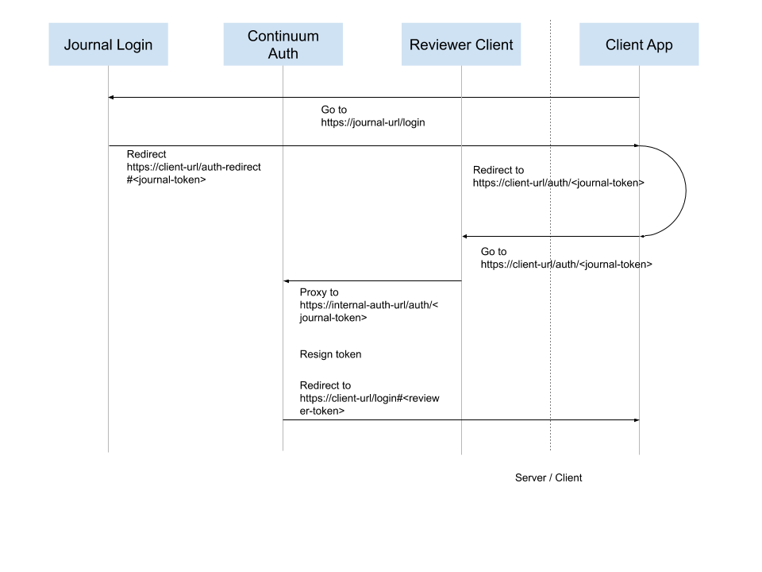
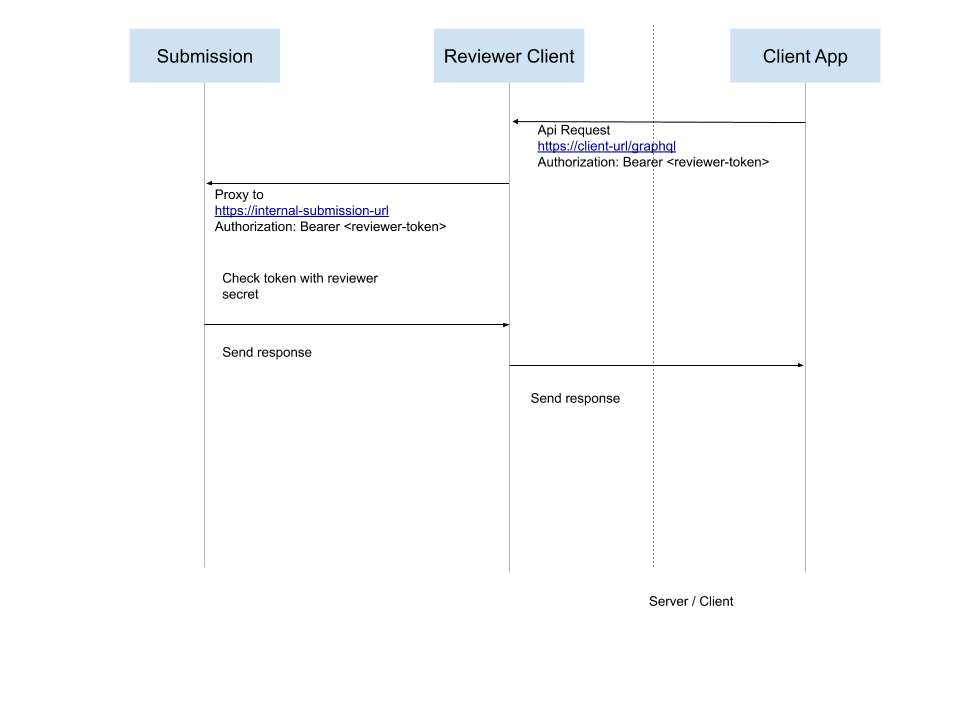

# Authentication

## Overview
The `continuum-auth` service provides authentication functionality for libero reviewer, which provides an interface to the continuum authentication system. That service provides an endpoint that converts the continuum auth token into a libero reviewer specific token.

## Authentication flow

### Logging in

1. The user is directed first to the continuum journal login. This redirects the user to ORCID.
2. After authentication in ORCID, the user is then redirected to an authentication url that includes the journal token as a paraneter (`journal-token`). That request is then proxied
to the `continuum-auth` service (as its not accessible directly).
3. The token is re-signed using a different secret (`reviewer-secret`). See the [auth-utils package](https://github.com/libero/auth-utils) for more information.
4. Tthe user is then redirected to the client app where the token is stored in the browser's local storage.

### Authenticating requests

Subsequent API requests are then made by the Client App along with the token. Services that authenticate requests will need access to the `reviewer-secret` value.

1. Client App makes an API request. Stored token is sent in the `Authorization` header
2. Request is proxied to submission service which verifies the token using the reviewer secret value.
3. Response is proxied back to the Client App