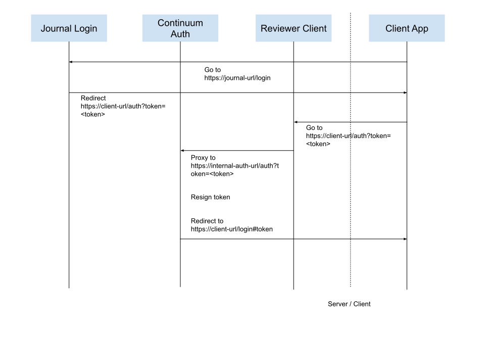

# Authentication

## Overview
The `continuum-auth` service provides authentication functionality for libero reviewer, which provides an interface to the continuum authentication system. That service provides an endpoint that converts the continuum auth token into a libero reviewer specific token.

## Authentication flow

1. The user is directed first to the continuum journal login. This redirects the user to ORCID.
2. After authentication in ORCID, the user is then redirected to an authentication url which is proxied to the `continuum-auth` service (as its not accessible directly).
3. The token is re-signed using a different secret.
4. Tthe user is then redirected to the client app where the token is stored in the browser's local storage.